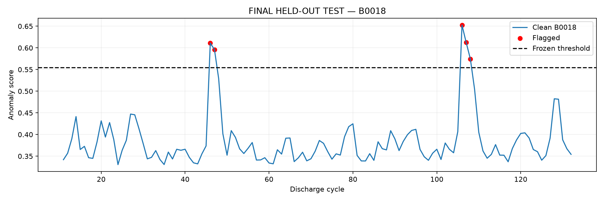
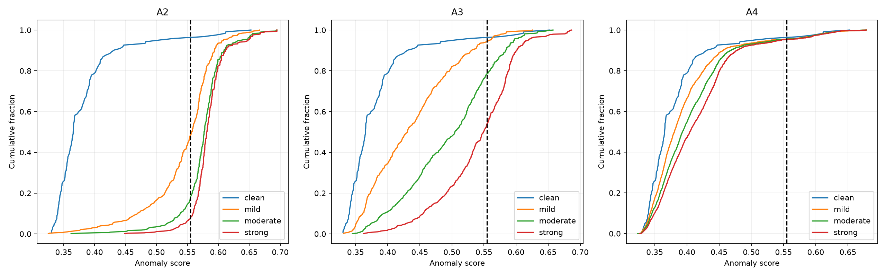

# Edge-Deployed Label-Free Anomaly Detection for Off-Grid Solar Battery Monitoring

This repository investigates lightweight, unsupervised anomaly detection for lithium-ion battery discharge cycles using causal history-relative features. The detector is evaluated across two public laboratory ageing datasets (NASA Ames and CALCE) and validated through physical replay on Raspberry Pi 3B+ edge hardware.

## Research question

Can a lightweight unsupervised model learn normal battery degradation behaviour from historical measurements, detect deviations from that behaviour without fault labels, and run efficiently on Raspberry Pi-class edge hardware?

## Why the method changed

Initial experiments applied standard Isolation Forest models to absolute battery discharge features (such as raw discharge capacity, cycle duration, and terminal voltage summary statistics). When evaluated across different battery cells, this absolute formulation failed:

1. Cross-cell clean false-positive rates (FPR) ranged from 21.43% to 73.81%, far exceeding the predefined tolerance of $\le 5\%$.
2. Burn-in threshold calibration still produced 63.70% to 100% later-trajectory clean FPR; none of 72 configuration groups passed the all-seed clean-FPR gate. Synthetic evaluation was withheld for that phase.
3. Diagnostics supported aging-related and cross-cell operating-distribution shifts; the artifacts do not isolate manufacturing variation as their cause.

Instead of abandoning the lightweight estimator, the feature representation was redesigned. Rather than scoring raw measurements, each discharge cycle is represented by causal residuals computed relative to that specific cell's recent history.

## Method

The method uses **unsupervised fitting on an early-life nominal proxy, evaluated with controlled synthetic anomalies**:

- **Early-life nominal proxy:** Models are fitted on the initial cycles of training cells (nominal operational window) without exposure to labelled fault examples. Early-life cycles are treated as nominal operational proxies, not certified fault-free baselines.
- **Causal relative features:** For cycle $t$, residual features are computed by subtracting the median of prior observations within a sliding history window ($k=10$) and normalizing by `1.4826 * MAD + 1e-9`. History 10 is the selected reporting reference, not a demonstrated global optimum.
- **Strict causality:** Only cycles strictly prior to cycle $t$ enter the baseline calculation. Current and future cycle statistics never leak into the historical reference.
- **Reporting configuration:** Isolation Forest with 100 trees, `max_features=1.0`, `max_samples='auto'`, `contamination='auto'`, and reporting seed 42.
- **Decision threshold:** Selected at the 95th percentile (P95) of anomaly scores on clean nominal training data.
- **Synthetic anomalies:** Labelled synthetic anomalies (sustained accelerated degradation in development, premature voltage collapse, thermal abnormalities, and gradual sensor drift) are used exclusively for sensitivity evaluation and never enter model fitting.

## Experimental design

The evaluation enforces strict separation between cell roles:

- **NASA dataset (2.0 Ah nominal):**
  - Training cells: B0005, B0006 (cycles 1-50 nominal proxy; the history-10 final representation uses cycles 11-50, totaling 80 training rows).
  - Validation cell: B0007 (cycles 11 to 168 clean evaluation).
  - Guarded final evaluation cell: B0018 (cycles 11 to 132 clean and synthetic evaluation).
  - Feature set: Seven measurement-relative residual features (`duration_s`, `time_to_3_4v_s`, `mean_voltage_v`, `mean_current_a`, `mean_temp_c`, `max_temp_c`, `delta_temp_c`).
- **CALCE dataset (LiCoO2, 1.1 Ah nominal):**
  - Training cells: CS2-35, CS2-36 (earliest 30% nominal proxy: cycles 1-264 and 1-291; history exclusion leaves 254 + 281 = 535 training rows).
  - Validation cell: CS2-37 (1,026 clean cycles).
  - Guarded final evaluation cell: CS2-38 (1,015 clean cycles).
  - Feature set: Four measurement-relative residual features (`duration_s`, `time_to_3_4v_s`, `mean_voltage_v`, `mean_current_a`). Thermal channels were unavailable in this dataset.
  - Role: Independent methodology replication. The CALCE model was separately fitted from scratch; the NASA model was not transferred directly across datasets.

### Note on cell isolation

B0018 and CS2-38 were excluded from guarded fitting and threshold selection, but appeared earlier during extraction/descriptive auditing. Final evaluation used frozen models and scalers without fitting or retuning.

## Main results

The causal history-relative representation achieved clean false-positive rates below the $5\%$ design target across validation and final test cells for both datasets:

| Dataset | Cell role | Cell ID | Usable cycles | Flagged clean cycles | Clean FPR | Predefined target |
|---|---|---|---|---|---|---|
| NASA | Validation | B0007 | 158 | 3 | 1.90% | $\le 5\%$ |
| NASA | Final test | B0018 | 122 | 5 | 4.10% | $\le 5\%$ |
| CALCE | Validation | CS2-37 | 1,026 | 26 | 2.53% | $\le 5\%$ |
| CALCE | Final test | CS2-38 | 1,015 | 32 | 3.15% | $\le 5\%$ |

Thresholds were frozen at the 95th percentile of clean training scores ($0.554868$ for NASA; $0.595563$ for CALCE).

## Controlled anomaly evaluation

Sensitivity was evaluated using controlled synthetic anomalies injected into clean test-cell cycles. Results show clear severity dependence for abrupt profile deviations, alongside limited sensitivity to subtle sensor drift:

### NASA B0018 synthetic recall

| Anomaly type | Mild | Moderate | Strong |
|---|---|---|---|
| A2: Premature voltage collapse | 51.69% | 82.37% | 92.54% |
| A3: Thermal excursion | 5.76% | 21.53% | 46.10% |
| A4: Gradual sensor drift | 4.50% | 4.55% | 4.67% |

### CALCE CS2-38 synthetic recall

| Anomaly type | Mild | Moderate | Strong |
|---|---|---|---|
| A2: Premature voltage collapse | 20.26% | 35.51% | 49.44% |
| A4: Gradual voltage drift | 2.92% | 3.25% | 3.61% |

Premature voltage collapse (A2) shows consistent recall scaling with anomaly magnitude in the two separately fitted dataset studies. In contrast, gradual sensor drift (A4) demonstrates that slow, cumulative perturbations are absorbed into sliding historical baselines with weak thresholded sensitivity.

## Raspberry Pi replay

The frozen NASA inference pipeline was packaged and benchmarked on physical edge hardware:

- **Target hardware:** Raspberry Pi 3B+ (ARM Cortex-A53, 4 cores @ 1.2 GHz, 905 MiB RAM, Debian 13 trixie, aarch64, Python 3.13.5).
- **Execution mode:** Sequential replay of recorded B0018 discharge cycle observations (122 scorable cycles).
- **Prediction fidelity:** Zero mismatches against workstation predictions ($122/122$ identical scores and binary decisions, maximum score difference $0.0$).
- **Latency (1,000 timed observations):**
  - Causal feature computation: Median 0.76 ms (P95: 0.85 ms).
  - Isolation Forest inference: Median 63.00 ms (P95: 64.17 ms).
  - Total per-cycle latency: Median 63.77 ms (P95: 64.94 ms).
  - Throughput: 15.64 observations/second.
- **Resource utilization:** Resident set size (RSS) remained approximately 130 MB. Power consumption was not measured.

*Hardware validation scope:* This experiment validates cycle-level inference latency and numerical equivalence on physical edge hardware. It does not constitute live sensor acquisition, real-time battery management system (BMS) integration, or field deployment.

## Negative results

Preserving negative findings is central to this research:

1. **Absolute feature representation failure:** Standard Isolation Forests trained on raw measurement features failed the clean validation tolerance (FPR 21.43%-73.81%).
2. **Burn-in threshold calibration failure:** Early B0007 threshold calibration failed the later-trajectory clean-FPR gate across all configuration groups; synthetic sensitivity was not evaluated after that failed gate.
3. **Weak gradual sensor drift sensitivity:** Causal sliding-window baselines adapt to slow measurement drift, resulting in detection recall under $5\%$ for gradual drift anomalies.

## Reproducibility and quick start

The v0.2 working tree packages final frozen NASA/CALCE estimators, scalers and bundles, six selected research figures, a SHA-256 manifest and a deterministic synthetic demo. External datasets are needed only for full experiment reproduction.

With Python 3.14.6 in an activated environment, run from the repository root:

```bash
python -m pip install -r requirements-lock.txt
python -B demo/run_demo.py
python -B scripts/verify_artifacts.py --load-models
python -B -m unittest tests.test_calce_cs2_35_extraction tests.test_nasa_causal_features tests.test_v02_reproducibility -v
```

The demo generates its own observations and fits a separate synthetic model. It shows ten prior-cycle warmup rows, history-relative features, scaling, scoring and thresholded predictions; it does not reproduce the reported FPRs. See [demo details](demo/README.md).

- **Level 1:** Run the synthetic demo without NASA/CALCE data.
- **Level 2:** Inspect and verify [released artifacts](artifacts/README.md), [model/figure/evidence hashes](artifacts/manifest.json) and compact results.
- **Level 3:** Independently obtain the source datasets, preprocess, validate, freeze and evaluate in an isolated run directory.

Follow [docs/reproduction.md](docs/reproduction.md) for the environment, exact cell roles, full workflow, edge replay and limitations. [Validation results](docs/v02-validation.md) distinguish self-contained tests from research tests requiring omitted inputs. Historical receipts remain unchanged and still reference archive-only dependencies. Joblib files can execute code when loaded: use trusted sources and verify hashes before deserialization.

## Selected research figures



NASA B0018 final test, clean evaluation: 5 of 122 scorable cycles exceed the frozen threshold (4.10%).



B0018 final synthetic evaluation: A2/A3 severity changes score distributions, while A4 remains weak at the frozen threshold. These are synthetic evaluation labels, not observed faults. The [manifest](artifacts/manifest.json) also inventories clean CALCE final scores, B0007 validation comparisons and A4 severity results with provenance and interpretation.

## Repository structure

| Path | Contents |
|---|---|
| `artifacts/` | Release manifest and six selected figures |
| `models/final_nasa/`, `models/final_calce/` | Exact final estimator, scaler, bundle and historical freeze receipts |
| `demo/` | Synthetic-only runnable mechanics demonstration |
| `config/`, `results/` | Frozen definitions and compact research evidence |
| `deployment/pi/` | Frozen NASA runtime, duplicate runtime binaries and hardware evidence |
| `scripts/`, `tests/` | Research pipeline, artifact verifier, isolated-run preparation and tests |
| `docs/` | Reproduction, data acquisition, scientific scope and validation records |

## Limitations

- **Laboratory ageing data:** Evaluated on constant-current laboratory cycle profiles; real off-grid solar storage encounters variable depth of discharge, erratic solar charging profiles, and seasonal rest intervals.
- **Synthetic anomaly evaluation:** Due to a lack of verified natural operational faults in public datasets, sensitivity was evaluated using synthetic perturbations.
- **Slow drift vulnerability:** Sliding historical windows accommodate slow drift over time, limiting detection of gradual sensor calibration loss.
- **Cycle-level granularity:** The pipeline operates on aggregated per-cycle features rather than sub-second continuous sensor telemetry.
- **No live field deployment:** Hardware tests reflect recorded data replay on an isolated Raspberry Pi, not live field installation or battery pack protection control.

## Research process

For a detailed narrative detailing how initial failures led to causal relative features, why burn-in thresholding failed, and how the replication was structured, see [docs/research-process.md](docs/research-process.md).

## Development assistance / provenance

AI-assisted coding tools were used during research script development and public repository reconstruction. All scientific conclusions, threshold selections, and performance figures are grounded in executed result files and verified against immutable archival records.

## Status

- Research evaluation: Complete.
- Raspberry Pi hardware replay: Complete.
- Public repository reconstruction: Prepared from verified research artifacts.

## Release and license

The published version is **0.1.0**; this working tree prepares the **v0.2 reproducibility upgrade** with selected figures and frozen models. No new release has been published, and citation metadata still identifies v0.1.0. This is research software, not a peer-reviewed publication. Raw datasets and source-derived measurement tables remain excluded. The [MIT license](LICENSE) applies to original repository code/material owned by Adejire Adegite; it does not relicense NASA data, CALCE data or third-party materials. See [CITATION.cff](CITATION.cff) for citation metadata.

## Evidence notes

The tables use seed 42. CS2-37 P95 validation FPR averaged over seeds 42, 123 and 2026 is 3.15%; its seed-42 reference is 2.53%. A1 has no final B0018 result because it is inapplicable to frozen RELATIVE_B. Sources: [NASA final report](results/nasa_final_test.md), [NASA anomaly metrics](results/nasa_final_test/anomaly_metrics.csv), [CALCE thresholds](results/calce_replication/thresholds.csv), [CALCE final summary](results/calce_final_test/summary.json), and [Pi benchmark](deployment/pi/results/pi_benchmark.json). Warm timing excludes CSV I/O and context preparation. The saved peak RSS is below instantaneous RSS; its cause is unverified, so it is not a reliable memory upper bound. Power was not measured.
